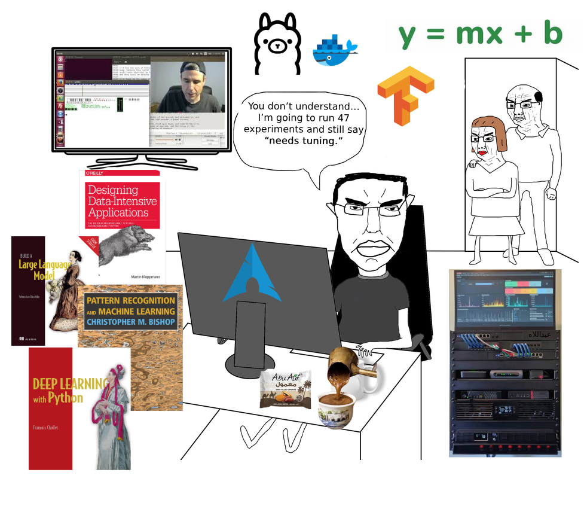

# Mohamed Abdellah

  

  <b>Junior Data Scientist | Machine Learning | SQL | Time Series | AI Enthusiast</b>

---

## About Me

Computer Science and artificial intelligence graduate with a strong foundation in algorithms, databases, and statistical modeling 

I work across SQL, Python, and machine learning pipelines, building end-to-end systems from raw, messy data to structured, explainable models.

### Core Strengths
- Statistical analysis & experimentation  
- End-to-end Machine Learning pipelines (data cleaning → modeling → evaluation)  
- Feature engineering & preprocessing for real-world datasets  
- Predictive modeling & performance evaluation  
- Statistical analysis & hypothesis testing for model validation  
- Experimentation & hyperparameter tuning  
- Exploratory Data Analysis & visualization to uncover patterns  
- Working with large-scale datasets efficiently in Python & SQL  

---

> Sometimes I train a model just to watch it fail spectacularly. It’s therapeutic.

---

## 🛠 Tech Stack

### 👨‍💻 Programming & Data

   
    

### 🤖 Machine Learning

   

### 📊 Data & BI

 

### ⚙️ Tools & Engineering

  

---

## 📫 Connect With Me

 

---

